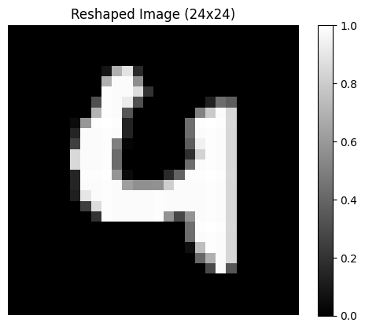

# HLS project
Прстая нейронка с одним скрытым слоем на 16 нейронов и выходом в 10 классов на основе mnist
## Базовая информация

```python
model = keras.Sequential([
    layers.Flatten(input_shape=(28, 28)),
    layers.Dense(16, activation='relu'),
    layers.Dense(10, activation='softmax')
])
```

Информация:
```text
Model: "sequential"
_________________________________________________________________
 Layer (type)                Output Shape              Param #   
=================================================================
 flatten (Flatten)           (None, 784)               0         
                                                                 
 dense (Dense)               (None, 16)                12560     
                                                                 
 dense_1 (Dense)             (None, 10)                170       
                                                                 
=================================================================
Total params: 12730 (49.73 KB)
Trainable params: 12730 (49.73 KB)
Non-trainable params: 0 (0.00 Byte)
_________________________________________________________________
```

# Предобработка входа

Пример входного изображения и его array размера (784,)



Данные изображения:
<details><summary>Длинный текст</summary>

```
 0.0000,
 0.0000,  0.0000,  0.0000,  0.0000,  0.0000,  0.0000,  0.0000,  0.0000,  0.0000,  0.0000,  0.0000,  0.0000,  0.0000,  0.0000,  0.0000,  0.0000,  0.0000,  0.0000,  0.0000,  0.0000,  0.0000,  0.0000,  0.0000,  0.0000,  0.0000,  0.0000,  0.0000,  0.0000,
 0.0000,  0.0000,  0.0000,  0.0000,  0.0000,  0.0000,  0.0000,  0.0000,  0.0000,  0.0000,  0.0000,  0.0000,  0.0000,  0.0000,  0.0000,  0.0000,  0.0000,  0.0000,  0.0000,  0.0000,  0.0000,  0.0000,  0.0000,  0.0000,  0.0000,  0.0000,  0.0000,  0.0000,
 0.0000,  0.0000,  0.0000,  0.0000,  0.0000,  0.0000,  0.0000,  0.0000,  0.0000,  0.0000,  0.0000,  0.0000,  0.0000,  0.0000,  0.0000,  0.0000,  0.0000,  0.0000,  0.0000,  0.0000,  0.0000,  0.0000,  0.0000,  0.0000,  0.0000,  0.0000,  0.0000,  0.0000,
 0.0000,  0.0000,  0.0000,  0.0000,  0.0000,  0.0000,  0.0000,  0.0000,  0.0000,  0.0000,  0.0000,  0.0000,  0.0000,  0.0000,  0.0000,  0.0000,  0.0000,  0.0000,  0.0000,  0.0000,  0.0000,  0.0000,  0.0000,  0.0000,  0.0000,  0.0000,  0.0000,  0.0000,
 0.0000,  0.0000,  0.0000,  0.0000,  0.0000,  0.0000,  0.0000,  0.0000,  0.0824,  0.6902,  0.8902,  0.1647,  0.0000,  0.0000,  0.0000,  0.0000,  0.0000,  0.0000,  0.0000,  0.0000,  0.0000,  0.0000,  0.0000,  0.0000,  0.0000,  0.0000,  0.0000,  0.0000,
 0.0000,  0.0000,  0.0000,  0.0000,  0.0000,  0.0000,  0.0000,  0.0000,  0.6902,  0.9843,  0.9843,  0.5569,  0.0000,  0.0000,  0.0000,  0.0000,  0.0000,  0.0000,  0.0000,  0.0000,  0.0000,  0.0000,  0.0000,  0.0000,  0.0000,  0.0000,  0.0000,  0.0000,
 0.0000,  0.0000,  0.0000,  0.0000,  0.0000,  0.0000,  0.0000,  0.0000,  0.9922,  0.9843,  0.9843,  0.8627,  0.2000,  0.0000,  0.0000,  0.0000,  0.0000,  0.0000,  0.0000,  0.0000,  0.0000,  0.0000,  0.0000,  0.0000,  0.0000,  0.0000,  0.0000,  0.0000,
 0.0000,  0.0000,  0.0000,  0.0000,  0.0000,  0.0000,  0.0000,  0.3098,  0.9922,  0.9843,  0.9216,  0.3216,  0.0000,  0.0000,  0.0000,  0.0000,  0.0000,  0.0000,  0.1255,  0.4275,  0.3647,  0.0000,  0.0000,  0.0000,  0.0000,  0.0000,  0.0000,  0.0000,
 0.0000,  0.0000,  0.0000,  0.0000,  0.0000,  0.0000,  0.0000,  0.7059,  0.9922,  0.9843,  0.3373,  0.0000,  0.0000,  0.0000,  0.0000,  0.0000,  0.0000,  0.5098,  0.7922,  0.9843,  0.8431,  0.0000,  0.0000,  0.0000,  0.0000,  0.0000,  0.0000,  0.0000,
 0.0000,  0.0000,  0.0000,  0.0000,  0.0000,  0.0431,  0.5882,  0.9922,  1.0000,  0.9922,  0.1373,  0.0000,  0.0000,  0.0000,  0.0000,  0.0000,  0.4314,  0.9922,  1.0000,  0.9922,  0.8471,  0.0000,  0.0000,  0.0000,  0.0000,  0.0000,  0.0000,  0.0000,
 0.0000,  0.0000,  0.0000,  0.0000,  0.0000,  0.1451,  0.9843,  0.9843,  0.9922,  0.9843,  0.1373,  0.0000,  0.0000,  0.0000,  0.0000,  0.0000,  0.4275,  0.9843,  0.9922,  0.9843,  0.8431,  0.0000,  0.0000,  0.0000,  0.0000,  0.0000,  0.0000,  0.0000,
 0.0000,  0.0000,  0.0000,  0.0000,  0.0000,  0.2471,  0.9843,  0.9843,  0.9922,  0.4980,  0.0196,  0.0000,  0.0000,  0.0000,  0.0000,  0.0000,  0.3647,  0.9451,  0.9922,  0.9843,  0.8431,  0.0000,  0.0000,  0.0000,  0.0000,  0.0000,  0.0000,  0.0000,
 0.0000,  0.0000,  0.0000,  0.0000,  0.0000,  0.8510,  0.9843,  0.9843,  0.9922,  0.4196,  0.0000,  0.0000,  0.0000,  0.0000,  0.0000,  0.0000,  0.1843,  0.8275,  0.9922,  0.9843,  0.8431,  0.0000,  0.0000,  0.0000,  0.0000,  0.0000,  0.0000,  0.0000,
 0.0000,  0.0000,  0.0000,  0.0000,  0.0000,  0.8510,  0.9843,  0.9843,  0.9922,  0.4196,  0.0000,  0.0000,  0.0000,  0.0000,  0.0000,  0.0000,  0.4275,  0.9843,  0.9922,  0.9843,  0.8431,  0.0000,  0.0000,  0.0000,  0.0000,  0.0000,  0.0000,  0.0000,
 0.0000,  0.0000,  0.0000,  0.0000,  0.0000,  0.1451,  0.9922,  0.9922,  1.0000,  0.5843,  0.0392,  0.0000,  0.0000,  0.0000,  0.1647,  0.3882,  0.9922,  0.9922,  1.0000,  0.9922,  0.8471,  0.0000,  0.0000,  0.0000,  0.0000,  0.0000,  0.0000,  0.0000,
 0.0000,  0.0000,  0.0000,  0.0000,  0.0000,  0.1451,  0.9843,  0.9843,  0.9922,  0.9843,  0.6235,  0.5647,  0.5647,  0.5686,  0.8078,  0.9843,  0.9843,  0.9843,  0.9922,  0.9843,  0.8431,  0.0000,  0.0000,  0.0000,  0.0000,  0.0000,  0.0000,  0.0000,
 0.0000,  0.0000,  0.0000,  0.0000,  0.0000,  0.1216,  0.9020,  0.9843,  0.9922,  0.9843,  0.9843,  0.9843,  0.9843,  0.9922,  0.9843,  0.9843,  0.9843,  0.9843,  0.9922,  0.9843,  0.8431,  0.0000,  0.0000,  0.0000,  0.0000,  0.0000,  0.0000,  0.0000,
 0.0000,  0.0000,  0.0000,  0.0000,  0.0000,  0.0000,  0.2431,  0.8627,  0.9922,  0.9843,  0.9843,  0.9843,  0.9843,  0.9922,  0.9843,  0.9843,  0.9843,  0.9843,  0.9922,  0.9843,  0.8431,  0.0000,  0.0000,  0.0000,  0.0000,  0.0000,  0.0000,  0.0000,
 0.0000,  0.0000,  0.0000,  0.0000,  0.0000,  0.0000,  0.0000,  0.2000,  0.9922,  0.9843,  0.9843,  0.9843,  0.9843,  0.9922,  0.5765,  0.2784,  0.5804,  0.9843,  0.9922,  0.9843,  0.8431,  0.0000,  0.0000,  0.0000,  0.0000,  0.0000,  0.0000,  0.0000,
 0.0000,  0.0000,  0.0000,  0.0000,  0.0000,  0.0000,  0.0000,  0.0000,  0.0000,  0.0000,  0.0000,  0.0000,  0.0000,  0.0000,  0.0000,  0.0000,  0.4314,  0.9922,  1.0000,  0.9922,  0.8471,  0.0000,  0.0000,  0.0000,  0.0000,  0.0000,  0.0000,  0.0000,
 0.0000,  0.0000,  0.0000,  0.0000,  0.0000,  0.0000,  0.0000,  0.0000,  0.0000,  0.0000,  0.0000,  0.0000,  0.0000,  0.0000,  0.0000,  0.0000,  0.4275,  0.9843,  0.9922,  0.9843,  0.8431,  0.0000,  0.0000,  0.0000,  0.0000,  0.0000,  0.0000,  0.0000,
 0.0000,  0.0000,  0.0000,  0.0000,  0.0000,  0.0000,  0.0000,  0.0000,  0.0000,  0.0000,  0.0000,  0.0000,  0.0000,  0.0000,  0.0000,  0.0000,  0.0588,  0.7451,  0.9922,  0.9843,  0.8431,  0.0000,  0.0000,  0.0000,  0.0000,  0.0000,  0.0000,  0.0000,
 0.0000,  0.0000,  0.0000,  0.0000,  0.0000,  0.0000,  0.0000,  0.0000,  0.0000,  0.0000,  0.0000,  0.0000,  0.0000,  0.0000,  0.0000,  0.0000,  0.0000,  0.4039,  0.6863,  0.9843,  0.8431,  0.0000,  0.0000,  0.0000,  0.0000,  0.0000,  0.0000,  0.0000,
 0.0000,  0.0000,  0.0000,  0.0000,  0.0000,  0.0000,  0.0000,  0.0000,  0.0000,  0.0000,  0.0000,  0.0000,  0.0000,  0.0000,  0.0000,  0.0000,  0.0000,  0.0000,  0.2863,  0.9843,  0.3373,  0.0000,  0.0000,  0.0000,  0.0000,  0.0000,  0.0000,  0.0000,
 0.0000,  0.0000,  0.0000,  0.0000,  0.0000,  0.0000,  0.0000,  0.0000,  0.0000,  0.0000,  0.0000,  0.0000,  0.0000,  0.0000,  0.0000,  0.0000,  0.0000,  0.0000,  0.0000,  0.0000,  0.0000,  0.0000,  0.0000,  0.0000,  0.0000,  0.0000,  0.0000,  0.0000,
 0.0000,  0.0000,  0.0000,  0.0000,  0.0000,  0.0000,  0.0000,  0.0000,  0.0000,  0.0000,  0.0000,  0.0000,  0.0000,  0.0000,  0.0000,  0.0000,  0.0000,  0.0000,  0.0000,  0.0000,  0.0000,  0.0000,  0.0000,  0.0000,  0.0000,  0.0000,  0.0000,  0.0000,
 0.0000,  0.0000,  0.0000,  0.0000,  0.0000,  0.0000,  0.0000,  0.0000,  0.0000,  0.0000,  0.0000,  0.0000,  0.0000,  0.0000,  0.0000,  0.0000,  0.0000,  0.0000,  0.0000,  0.0000,  0.0000,  0.0000,  0.0000,  0.0000,  0.0000,  0.0000,  0.0000,  0.0000,
 0.0000,  0.0000,  0.0000,  0.0000,  0.0000,  0.0000,  0.0000,  0.0000,  0.0000,  0.0000,  0.0000,  0.0000,  0.0000,  0.0000,  0.0000,  0.0000,  0.0000,  0.0000,  0.0000,  0.0000,  0.0000,  0.0000,  0.0000,  0.0000,  0.0000,  0.0000,  0.0000
```

</details>

Для подачи изображения в Vitas HSL следует сделать предобработку: `image.reshape(-1)`. Трансформация размерности (28, 28) -> (784,)

# Пример вывода
```text
INFO: [SIM 2] *************** CSIM start ***************
INFO: [SIM 4] CSIM will launch GCC as the compiler.
   Compiling ../../../code/matmul_tb.cpp in debug mode
   Generating csim.exe
NN Prediction: 5, should be: 5 from x_test[120]
NN Prediction: 0, should be: 0 from x_test[485]
NN Prediction: 6, should be: 9 from x_test[130]
NN Prediction: 4, should be: 4 from x_test[762]
INFO: [SIM 1] CSim done with 0 errors.
INFO: [SIM 3] *************** CSIM finish ***************
```